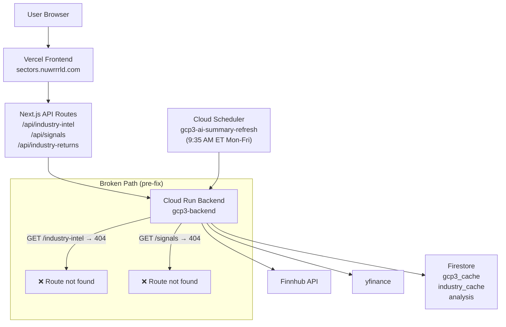
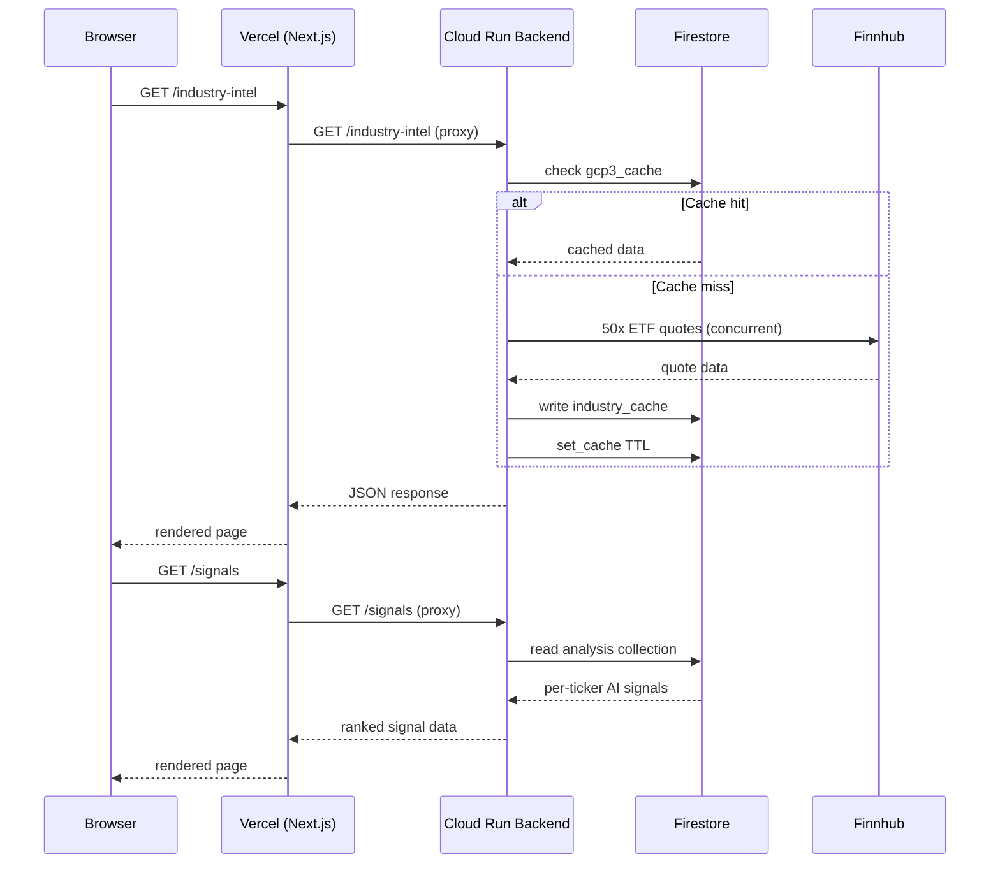

# Incident Report: Frontend Pages Down — 2026-04-09

## Summary

Three pages on `sectors.nuwrrrld.com` were broken or showing stale data:

| Page | Issue | Root Cause |
|------|-------|-----------|
| `/industry-intel` | Not loading (blank/error) | Backend serving old routes — `/industry-intel` returned 404 |
| `/signals` | Not loading (blank/error) | Backend serving old routes — `/signals` returned 404 |
| `/industry-returns` | Stale timestamp (Apr 8) | Morning refresh heavily rate-limited by Finnhub + yfinance; `industry_cache` not written today |

Secondary bug also found: `macro_pulse.py` crashed with `TypeError: NoneType doesn't define __round__` when Finnhub returned null for VIX/DXY (symbols not tradeable via standard quote API).

---

## System Architecture



---

## Root Cause Analysis

### Issue 1: 404 on `/industry-intel` and `/signals`

The backend `main.py` was updated with consolidated API endpoints (`/industry-intel`, `/signals`) as part of the API consolidation (17 → 8 endpoints), but the backend was **never redeployed**. The running Cloud Run revision still had the old routes:

- Old: `/industry-tracker`, `/industry-quotes`, `/technical-signals`
- New (in code, not deployed): `/industry-intel`, `/signals`

The frontend pages call the new endpoint names, which returned `{"detail": "Not Found"}` (FastAPI 404).

**Evidence from logs:**
```
GET 404 https://gcp3-backend-cif7ppahzq-uc.a.run.app/industry-intel
GET 404 https://gcp3-backend-cif7ppahzq-uc.a.run.app/signals
```

### Issue 2: Stale `industry-returns` timestamp

The `/refresh/all` scheduler ran at `2026-04-09T13:35 UTC`, but the `industry_cache` Firestore collection shows `updated: 2026-04-08T13:35:09`. This means Stage 3 (`get_industry_data`) failed to write new data today.

**Root cause:** Both Finnhub and yfinance were rate-limited simultaneously during the morning refresh:

```
ERROR industry: all sources failed for Medical Devices (IHI):
  finnhub=429 Too Many Requests
  yfinance=Too Many Requests. Rate limited.
```

When all sources fail for multiple industries, `_attach_stored_returns` is not called and `industry_cache` documents keep yesterday's `updated` timestamp. The `industry_returns` endpoint then serves a 6h Firestore cache from the prior successful run.

### Issue 3: `macro_pulse` VIX/DXY crash

`_fetch_quote()` in `macro_pulse.py` called `round(d["c"], 2)` without guarding against `None`. Finnhub returns `null` for `c` (current price) when a symbol like `VIX` or `DXY` has no tradeable quote data.

```python
# Before (broken):
return {"price": round(d["c"], 2), ...}  # crashes if d["c"] is None

# After (fixed):
def _safe_round(v): return round(v, 2) if v is not None else None
price = _safe_round(d.get("c"))
if price is None or price == 0:
    raise ValueError(f"No price data from Finnhub for {symbol}")
```

The error was caught and logged per ticker, so `macro_pulse` still returned a result — but VIX and DXY showed `error` instead of values, reducing regime signal accuracy.

---

## Request Flow Diagram (Post-Fix)



---

## Fixes Applied

| # | File | Change |
|---|------|--------|
| 1 | `backend/macro_pulse.py` | Guard `round()` calls with `None` check; raise `ValueError` for zero-price tickers |
| 2 | `backend/main.py` | Already had correct consolidated routes — deployed via Cloud Build |
| 3 | `backend/requirements.txt` | Added `google-auth==2.40.3` (needed for OIDC scheduler verification) |

**Deploy:** `gcloud builds submit --config cloudbuild.yaml` → revision `gcp3-backend-00031-k45` — SUCCESS

---

## Ongoing / Monitoring

### Rate-limit resilience for `industry_cache`

The morning refresh is vulnerable to simultaneous Finnhub + yfinance rate limits. When both fail, `industry_cache` is not updated and `industry-returns` shows stale timestamps.

**Mitigation options (not yet implemented):**
- Stagger ETF fetches with backoff between batches (currently all 50 fire concurrently)
- Add yfinance retry with exponential backoff after Finnhub 429
- Run `/admin/seed-etf-history` delta update separately to ensure price history is populated even if live quotes fail

### Deployment reminder

Any time `main.py` routes are added or renamed, redeploy immediately. The frontend expects the new route names — the old routes disappear with the old revision.

---

## Verification

After fix, confirmed via direct backend curl:

```
health:           200 ✅
industry-intel:   200 ✅
signals:          200 ✅
industry-returns: 200 ✅ (data from yesterday — stale but functional)
```
