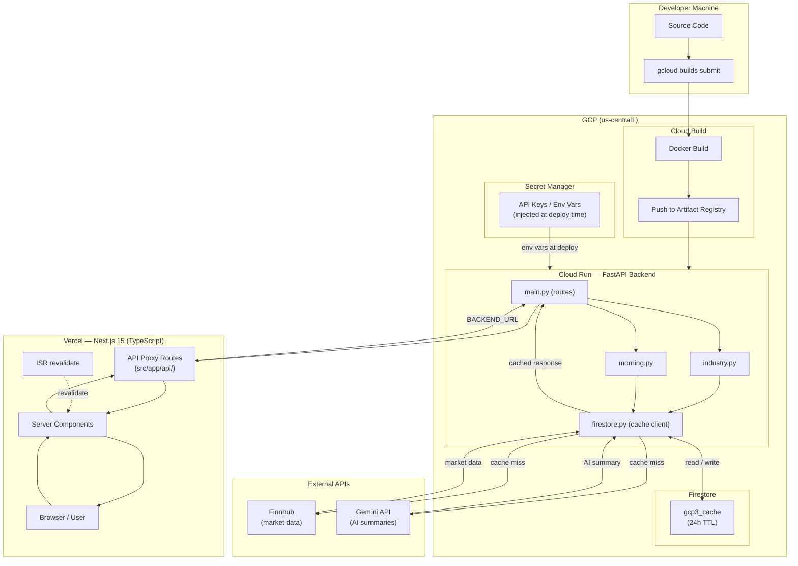

# Pipeline Summary — GCP3 Finance App

The GCP3 Finance App is built on a fully managed GCP infrastructure. The Python FastAPI backend runs on Cloud Run, with Cloud Build handling CI/CD — each `gcloud builds submit` triggers a Docker build, pushes the image to Artifact Registry, and deploys a new Cloud Run revision. Firestore serves as a 24-hour TTL cache layer, shielding the Finnhub API from redundant calls and keeping latency low. All secrets (API keys, project IDs) are injected at deploy time via Cloud Run environment variables or Secret Manager — never stored in code.

The Next.js 15 frontend is deployed to Vercel, written in strict TypeScript with Tailwind CSS for styling. Server Components handle all data fetching at the page level, calling Next.js API proxy routes that forward requests to the Cloud Run backend URL. Incremental Static Regeneration (`next: { revalidate: N }`) keeps pages fresh without hitting the backend on every request. This separation keeps the frontend stateless and the backend the single source of truth for all market data.

Gemini powers the AI-generated summaries surfaced in the Morning Brief and Industry Tracker features. The backend calls the Gemini API to synthesize raw Finnhub market data — index performance, sector rankings, and market tone — into readable prose. Results are cached in Firestore alongside the raw data, so Gemini is only invoked when the cache is cold. This keeps inference costs predictable while ensuring the AI commentary stays aligned with real, live market data rather than stale or fabricated figures.

## Workflow Diagram

