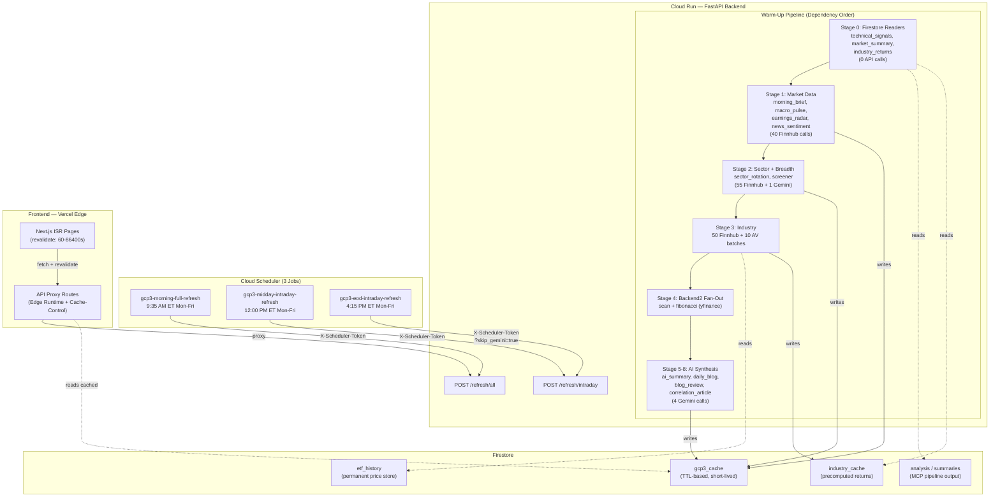
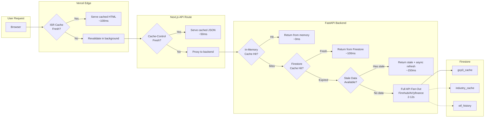
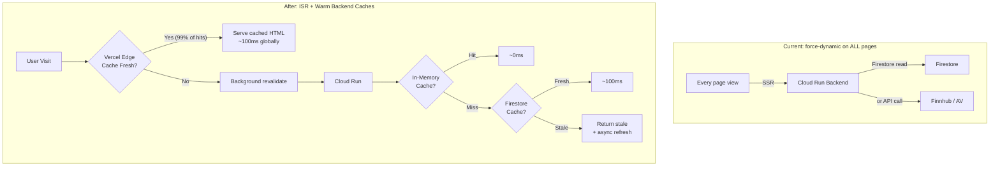

# Firestore Caching & Cloud Scheduler Warmup — Deep Optimization Guide

**Date:** 2026-04-07
**Builds upon:** `isr_optimization_strategy.md`, `cache-pipeline-notes.md`, `PERSISTENT_STORAGE_EFFICIENCY-gcp3.md`, `scheduling-architecture.md`, `PERFORMANCE_OPTIMIZATIONS.md`

---

## Architecture Overview



---

## Current State Summary

### What Works Well

| Component | Status | Notes |
|-----------|--------|-------|
| 3-tier Firestore model | Solid | `gcp3_cache` (TTL), `industry_cache` (precomputed), `etf_history` (permanent) |
| Cloud Scheduler 3-job cadence | Solid | Morning / midday / EOD covers full trading day |
| Dependency-ordered warm-up | Solid | 8 stages, AI runs last to aggregate prior caches |
| `expires_at` TTL check on read | Solid | Expired docs safely ignored |
| Semaphore-based rate limiting | Solid | Per-API concurrency control prevents quota overruns |

### What Needs Work

| Problem | Severity | Root Cause |
|---------|----------|------------|
| No native Firestore TTL policy | Medium | Expired docs accumulate indefinitely |
| Minute-bucket key proliferation | Medium | `industry_quotes:{minute}` creates 60 dead keys/hour |
| No in-memory cache layer | Medium | Every request hits Firestore even for identical data within seconds |
| No `/admin/purge-cache` endpoint | Medium | Manual cleanup only (119 docs purged by hand on 2026-04-03) |
| `date.today()` vs UTC inconsistency | Low | 9 modules still use local time for cache keys |
| No Cloud Scheduler min-instance warmup | Medium | Cold starts on first request after idle period |
| No stale-while-revalidate on backend | Medium | Cache miss = full Finnhub fan-out, no fallback |

---

## Optimization Plan

### Phase 1 — Zero-Code Firestore Fixes (Day 1)

#### 1A. Enable Native TTL on `gcp3_cache`

Firestore can auto-delete documents based on a timestamp field. Our `expires_at` field is already perfect for this.

```bash
gcloud firestore fields ttls update expires_at \
  --collection-group=gcp3_cache \
  --enable-ttl \
  --project=$GCP_PROJECT_ID
```

**Effect:** Firestore deletes expired documents within ~24h of expiry. No code changes. No read cost for the deletes. Eliminates unbounded collection growth permanently.

#### 1B. Set Cloud Run Min Instances to 1

Cold starts add 2-5s latency to the first request after idle. A single warm instance eliminates this.

```bash
gcloud run services update gcp3-backend \
  --region us-central1 \
  --min-instances=1 \
  --project=$GCP_PROJECT_ID
```

**Cost:** ~$5-10/month on free-tier pricing. Eliminates cold start latency for the scheduler and for first user requests.

---

### Phase 2 — Cache Architecture Improvements (Week 1)

#### 2A. Replace Minute-Bucket Keys with Single-Document Pattern

**Before:** `industry_quotes:{floor(time()/60)}` = 390 dead keys/trading day

**After:** One document `industry_quotes:live`, freshness checked by `updated_at` timestamp:

```python
QUOTE_FRESHNESS_SECONDS = 60

async def get_industry_quotes_cached() -> dict | None:
    doc = db().collection("gcp3_cache").document("industry_quotes:live").get()
    if not doc.exists:
        return None
    data = doc.to_dict()
    updated_at = data.get("updated_at")
    if updated_at and (datetime.now(timezone.utc) - updated_at).total_seconds() < QUOTE_FRESHNESS_SECONDS:
        return data.get("value")
    return None
```

**Impact:** Eliminates the single largest source of document churn. 1 document instead of 390/day.

#### 2B. Add In-Memory Cache Layer for Hot Paths

Cloud Run instances persist state between requests within the same container. A Python-level dict cache with short TTL eliminates Firestore round-trips for repeated reads within seconds.

```python
import time
from typing import Any

_MEM_CACHE: dict[str, tuple[float, Any]] = {}

def mem_get(key: str, max_age: float = 60.0) -> Any | None:
    entry = _MEM_CACHE.get(key)
    if entry and (time.monotonic() - entry[0]) < max_age:
        return entry[1]
    return None

def mem_set(key: str, value: Any) -> None:
    _MEM_CACHE[key] = (time.monotonic(), value)
```

Layer into `get_cache()`:

```
Request → mem_cache (0ms) → Firestore gcp3_cache (50-200ms) → API call (1-8s)
```

**Impact:** Eliminates Firestore reads for the 60s window on warm instances. Best for `industry_quotes`, `screener`, `news_sentiment`.

#### 2C. Stale-While-Revalidate on Backend

The `get_cache_stale()` function already exists in `firestore.py` but is not widely used. Wire it into all cache-miss paths so users see last-known data instantly while a background refresh fires:

```python
async def get_screener_data():
    fresh = get_cache("screener:" + today)
    if fresh:
        return fresh

    stale, stale_as_of = get_cache_stale("screener:" + today)
    if stale:
        # Return stale data immediately, trigger async refresh
        asyncio.create_task(_refresh_screener())
        return {**stale, "_stale_as_of": stale_as_of}

    # No data at all — must block on fresh fetch
    return await _refresh_screener()
```

**Impact:** Cache misses return in <200ms instead of 2-8s. Users see data immediately.

---

### Phase 3 — Scheduler & Warmup Hardening (Week 2)

#### 3A. Add Pre-Market Warmup Job (8:30 AM ET)

The current first job at 9:35 AM means the cache is cold for early-morning users checking pre-market data. Add a lightweight pre-market warmup:

```
Job                              Cron (UTC)       ET Time          Target
gcp3-premarket-warmup            30 12 * * 1-5    8:30 AM ET       POST /refresh/premarket
```

This endpoint would warm only the lightweight endpoints (morning_brief, news_sentiment, macro_pulse) without the heavy industry/AV calls.

#### 3B. Add `/admin/purge-cache` Endpoint + Schedule

```python
@app.post("/admin/purge-cache")
async def purge_expired_cache(
    x_scheduler_token: str | None = Header(default=None),
) -> dict:
    _verify_scheduler(x_scheduler_token)
    now = datetime.now(timezone.utc)
    deleted = 0
    batch = db().batch()
    batch_count = 0

    query = (
        db().collection("gcp3_cache")
        .where("expires_at", "<", now)
        .limit(450)
    )
    for snap in query.stream():
        batch.delete(snap.reference)
        batch_count += 1
        deleted += 1
        if batch_count >= 450:
            batch.commit()
            batch = db().batch()
            batch_count = 0

    if batch_count > 0:
        batch.commit()

    return {"deleted": deleted, "timestamp": now.isoformat()}
```

Schedule nightly:
```
Job                              Cron (UTC)       ET Time          Target
gcp3-nightly-cache-purge         0 6 * * *        2:00 AM ET       POST /admin/purge-cache
```

**Note:** This is a safety net alongside the native TTL (Phase 1A). The TTL handles automatic cleanup; this endpoint provides visibility and auditing.

#### 3C. Align All Daily Cache Keys to UTC Midnight

Roll out the `ttl_until_midnight_utc()` pattern (already used in `daily_blog.py`, `blog_reviewer.py`, `correlation_article.py`) to all remaining modules:

**Modules still using fixed TTL with `date.today()`:**
- `morning.py` (8h TTL)
- `screener.py` (1h TTL)
- `sector_rotation.py` (2h TTL)
- `macro_pulse.py` (2h TTL)
- `news_sentiment.py` (1h TTL)
- `earnings_radar.py` (6h TTL)
- `market_summary.py` (2h TTL)
- `technical_signals.py` (2h TTL)
- `ai_summary.py` (midnight TTL)
- `industry.py` (24h TTL)
- `industry_returns.py` (6h TTL)

For short-TTL endpoints (1-2h), keep the short TTL but use `datetime.now(timezone.utc).date()` instead of `date.today()`. For daily endpoints, switch to midnight-aligned TTL.

---

### Phase 4 — Advanced Optimizations (Week 3+)

#### 4A. Precompute Returns Off the Request Path

Move `_attach_stored_returns()` from the live `/industry-tracker` request path to the scheduled warmup. Cloud Scheduler calls `POST /admin/compute-returns` daily, writing precomputed results to `industry_cache`. The live endpoint reads from `industry_cache` with zero DataFrame work.

**Current flow (on cache miss):**
```
/industry-tracker → 50 Finnhub calls → 50 Firestore etf_history reads → pandas compute → respond
```

**Optimized flow:**
```
Cloud Scheduler → /admin/compute-returns → writes industry_cache
/industry-tracker → reads industry_cache (1 Firestore read) → respond
```

**Impact:** Cache-miss latency drops from 8-12s to <500ms.

#### 4B. Move Alpha Vantage Off the Live Request Path

AV enrichment (10 batched calls) currently runs inline during `/industry-tracker` cache miss. Move to `POST /admin/compute-returns` or a dedicated `POST /admin/enrich-av`. AV data is statistical (1-month return, mean, stddev) — doesn't need to be real-time.

#### 4C. Response Compression

```python
from fastapi.middleware.gzip import GZipMiddleware
app.add_middleware(GZipMiddleware, minimum_size=1000)
```

Industry tracker payloads shrink from ~35-50 KB to ~8-12 KB. A one-line fix.

---

## Full Data Flow — Request Lifecycle



---

## Cache Tier Summary

| Tier | Location | TTL | Latency | Shared Across Instances |
|------|----------|-----|---------|------------------------|
| 1 - ISR Page Cache | Vercel Edge CDN | 60-86400s | ~100ms | Yes (global CDN) |
| 2 - API Route Cache | Vercel CDN | s-maxage per route | ~50ms | Yes (global CDN) |
| 3 - In-Memory | Python dict on Cloud Run | 60s | ~0ms | No (per-instance) |
| 4 - Firestore gcp3_cache | Firestore | 1-24h per key | 50-200ms | Yes (all instances) |
| 5 - Firestore Permanent | etf_history, industry_cache | Permanent | 50-200ms | Yes (all instances) |
| 6 - API Source | Finnhub, AV, yfinance | N/A | 1-12s | N/A |

---

## Cloud Scheduler Job Summary (Proposed)

| Job | Cron (UTC) | ET Time | Endpoint | Purpose |
|-----|-----------|---------|----------|---------|
| `gcp3-premarket-warmup` | `30 12 * * 1-5` | 8:30 AM | `POST /refresh/premarket` | Warm lightweight endpoints for early users |
| `gcp3-morning-full-refresh` | `35 13 * * 1-5` | 9:35 AM | `POST /refresh/all` | Full 8-stage warm-up |
| `gcp3-midday-intraday-refresh` | `0 16 * * 1-5` | 12:00 PM | `POST /refresh/intraday` | Short-TTL refresh |
| `gcp3-eod-intraday-refresh` | `15 20 * * 1-5` | 4:15 PM | `POST /refresh/intraday?skip_gemini=true` | EOD refresh, skip Gemini |
| `gcp3-nightly-cache-purge` | `0 6 * * *` | 2:00 AM | `POST /admin/purge-cache` | Clean expired docs (safety net) |

---

## Implementation Priority

| Priority | Optimization | Effort | Impact | Phase |
|----------|-------------|--------|--------|-------|
| 1 | Enable Firestore native TTL on `expires_at` | 1 command | Fixes unbounded growth | 1 |
| 2 | Set Cloud Run min-instances=1 | 1 command | Eliminates cold starts | 1 |
| 3 | Replace minute-bucket with single key | ~1h | Reduces churn 390x | 2 |
| 4 | Add in-memory cache layer | ~2h | Eliminates Firestore reads on hot paths | 2 |
| 5 | Wire stale-while-revalidate into all endpoints | ~2h | Cache misses return in <200ms | 2 |
| 6 | Add `/admin/purge-cache` + nightly schedule | ~1h | Auditable cleanup | 3 |
| 7 | Add pre-market warmup job | ~1h | Warm cache for early users | 3 |
| 8 | Align all daily keys to UTC midnight | ~30min | Consistency across modules | 3 |
| 9 | Precompute returns off request path | ~3h | Cache-miss latency: 12s to <500ms | 4 |
| 10 | Move AV off live path | ~1h | Remove 10 API calls from hot path | 4 |
| 11 | GZipMiddleware | 1 line | 70-80% payload compression | 4 |
| 12 | Remove `force-dynamic` from 13 pages, add ISR `revalidate` | ~30min | 99%+ requests served from edge CDN | 5 |
| 13 | Add `Cache-Control` headers to 10 remaining API routes | ~30min | CDN caching for client-side fetches | 5 |
| 14 | Remove blanket `no-store` from `vercel.json` | 1 line | Unblocks per-route API caching | 5 |

---

## Phase 5 — ISR Frontend Optimization (Per Feature)

With the backend changes from Phases 1-4 in place (warm caches, in-memory layer, stale-while-revalidate, precomputed returns), the frontend can safely drop `force-dynamic` on every page and switch to ISR. This is the final multiplier — Vercel's edge CDN serves cached HTML globally, and background revalidation keeps it fresh without any user-facing latency.

### Current Problem

**Every page exports `force-dynamic`**, which overrides the `next: { revalidate }` hints on individual `fetch()` calls. This means every single page view triggers a full SSR round-trip to Cloud Run, even when the backend data hasn't changed in hours.

Additionally, only 3 of 13 API proxy routes set `Cache-Control` headers, and `vercel.json` may still override with `no-store` on `/api/*`.

### How These Recommendations Differ from `isr_optimization_strategy.md`

The original ISR doc recommended conservative `revalidate` values (e.g., Morning Brief at 21600s, Industry Returns at 21600-86400s) because it assumed backend cache misses would be expensive. With the full backend warmup stack (Phases 1-4), every ISR revalidation now hits a warm cache — meaning we can safely use **much shorter ISR intervals** without increasing backend load. Shorter intervals = fresher data for users at near-zero cost.

| Feature | Original ISR Doc | This Doc (Post-Warmup) | Why More Aggressive |
|---------|-----------------|------------------------|---------------------|
| Morning Brief | 21600 (6h) | 300 (5min) | Scheduler warms at 8:30 + 9:35 AM. Revalidation hits warm Firestore in ~100ms. |
| Industry Returns | 21600-86400 | 3600 (1h) | Returns precomputed off request path (Phase 4). Reads 1 doc from `industry_cache`. |
| Market Summary | 21600-86400 | 3600 (1h) | Reads from permanent `summaries` collection. Zero API calls. |
| AI Summary | 21600-86400 | 14400 (4h) | Generated once daily. 4h still overkill, but catches rare mid-day regeneration. |
| Daily Blog | 21600-86400 | 14400 (4h) | Same as AI Summary. |
| Screener | 1800-3600 | 1800 (30min) | Scheduler refreshes 3x/day. 30min ISR catches the fresh data sooner. |
| Earnings Radar | 1800-3600 | 21600 (6h) | EPS data genuinely doesn't change intraday. Long ISR is correct here. |

### ISR Migration — Per Feature



#### High-Frequency Features (Live/Intraday Data)

These pages show data that changes during market hours. They benefit most from short ISR intervals combined with the backend's in-memory cache layer and scheduler warmups.

| Feature | Current | ISR `revalidate` | Backend Cache TTL | Scheduler Warmup | Why This Works |
|---------|---------|-------------------|-------------------|-------------------|----------------|
| **Industry Tracker** | `force-dynamic` | `60` (1 min) | Quotes: 60s (in-memory), Returns: precomputed | 9:35 AM + 12 PM + 4:15 PM | Quotes refresh every minute via ISR. Returns are precomputed daily — near-zero backend cost. The in-memory cache means even ISR revalidation hits return in ~0ms. |
| **Morning Brief** | `force-dynamic` | `300` (5 min) | 8h Firestore TTL | 9:35 AM (full), 8:30 AM (premarket) | Morning data is computed once at 9:35 AM and cached for 8h. ISR at 5min means at most 1 revalidation hits Cloud Run per 5 minutes — and that hit returns from warm Firestore cache in ~100ms. |
| **Screener** | `force-dynamic` | `1800` (30 min) | 1h Firestore TTL | 9:35 AM + 12 PM + 4:15 PM | Screener signal data recalculates hourly. 30-min ISR means 2 revalidations per cache period. Both hit warm Firestore cache after scheduler runs. |
| **News Sentiment** | `force-dynamic` | `1800` (30 min) | 1h Firestore TTL | 9:35 AM + 12 PM + 4:15 PM | Same pattern as screener. News cycles hourly; users see data at most 30 min stale. |

**Change per page:**
```tsx
// Remove:
export const dynamic = "force-dynamic";

// Add:
export const revalidate = 60; // or 300, 1800 per table above
```

#### Mid-Frequency Features (Multi-Hour Data)

These pages show data that shifts slowly through the trading day. The backend scheduler warms their caches 2-3 times daily, so ISR revalidation almost always hits a warm Firestore cache.

| Feature | Current | ISR `revalidate` | Backend Cache TTL | Scheduler Warmup | Why This Works |
|---------|---------|-------------------|-------------------|-------------------|----------------|
| **Sector Rotation** | `force-dynamic` | `3600` (1h) | 2h Firestore TTL | 9:35 AM + 12 PM + 4:15 PM | Momentum scores shift slowly. 1h ISR means the page revalidates at most once between scheduler refreshes. Each revalidation reads from Firestore in ~100ms. |
| **Macro Pulse** | `force-dynamic` | `3600` (1h) | 2h Firestore TTL | 9:35 AM + 12 PM + 4:15 PM | Cross-asset indicators move slowly. Same pattern as sector rotation. |
| **Technical Signals** | `force-dynamic` | `3600` (1h) | 2h Firestore TTL | 9:35 AM (reads MCP pipeline output) | Pipeline writes signals periodically. ISR at 1h is more than sufficient. Backend reads from permanent `analysis` collection — no API calls. |
| **Market Summary** | `force-dynamic` | `3600` (1h) | 2h Firestore TTL | 9:35 AM (reads `summaries` collection) | Reads precomputed summaries from MCP pipeline. Zero API cost on revalidation. |

#### Low-Frequency Features (Daily Data)

These pages show data that is computed once per day (morning warmup) and doesn't change until the next trading day. They get the biggest ISR win — a single revalidation after the 9:35 AM warmup serves every user for the rest of the day.

| Feature | Current | ISR `revalidate` | Backend Cache TTL | Scheduler Warmup | Why This Works |
|---------|---------|-------------------|-------------------|-------------------|----------------|
| **AI Summary** | `force-dynamic` | `14400` (4h) | Until midnight UTC | 9:35 AM (Stage 5) | Generated once by Gemini at 9:35 AM. Cached until midnight. ISR at 4h means ~2 background revalidations per day, both instant Firestore reads. |
| **Daily Blog** | `force-dynamic` | `14400` (4h) | Until midnight UTC | 9:35 AM (Stage 6) | Same as AI Summary. Gemini writes once, ISR serves all day. |
| **Blog Review** | `force-dynamic` | `14400` (4h) | Until midnight UTC | 9:35 AM (Stage 7) | Review of daily blog. Same daily cadence. |
| **Correlation Article** | `force-dynamic` | `14400` (4h) | Until midnight UTC | 9:35 AM (Stage 8) | Cross-asset correlation analysis. Generated once daily. |
| **Earnings Radar** | `force-dynamic` | `21600` (6h) | 6h Firestore TTL | 9:35 AM | EPS calendar data rarely changes intraday. 6h ISR aligns with backend TTL. |
| **Industry Returns** | `force-dynamic` | `3600` (1h) | 6h in `industry_cache` | 9:35 AM (precomputed) | After Phase 4, returns are precomputed off the request path. ISR revalidation reads from `industry_cache` — 1 Firestore read, zero API calls, ~100ms. |

#### User-Specific Features (Cannot Use ISR)

| Feature | Current | Strategy | Why |
|---------|---------|----------|-----|
| **Portfolio Analyzer** | `force-dynamic` | **Keep `force-dynamic`** | Accepts user-provided `?tickers=` query params. Infinite input space means ISR cannot precompute. Use client-side SWR/React Query with the API proxy route instead. The backend's in-memory + Firestore cache still helps — repeated identical ticker combos within 60s hit memory cache. |

### API Proxy Route Changes

Currently only `industry-quotes`, `industry-tracker`, and `industry-returns` routes set `Cache-Control` headers. All 13 routes should set headers aligned with their data freshness:

| API Route | Current `Cache-Control` | Recommended `Cache-Control` |
|-----------|------------------------|----------------------------|
| `/api/industry-quotes` | `s-maxage=3600, swr=7200` | `s-maxage=60, swr=300` (align with quote freshness) |
| `/api/industry-tracker` | `s-maxage=60, swr=300` | Keep as-is |
| `/api/industry-returns` | `s-maxage=300, swr=600` | Keep as-is |
| `/api/morning-brief` | None | `s-maxage=300, swr=1800` |
| `/api/screener` | None | `s-maxage=1800, swr=3600` |
| `/api/sector-rotation` | None | `s-maxage=3600, swr=7200` |
| `/api/macro-pulse` | None | `s-maxage=3600, swr=7200` |
| `/api/earnings-radar` | None | `s-maxage=21600, swr=43200` |
| `/api/news-sentiment` | None | `s-maxage=1800, swr=3600` |
| `/api/ai-summary` | None | `s-maxage=14400, swr=28800` |
| `/api/technical-signals` | None | `s-maxage=3600, swr=7200` |
| `/api/daily-blog` | None | `s-maxage=14400, swr=28800` |
| `/api/market-summary` | None | `s-maxage=3600, swr=7200` |

Also remove the blanket `no-store` from `vercel.json` if present, so per-route headers take effect.

### ISR + Backend Warmup Synergy

The key insight is that ISR alone is a partial win — without warm backend caches, the first ISR revalidation after a TTL expiry still triggers a slow Finnhub/Gemini fan-out. With the full optimization stack, the synergy is:

```
Cloud Scheduler warms backend caches (Phases 1-4)
    → ISR revalidation hits warm cache (~0-100ms)
        → Vercel edge serves cached HTML (~100ms globally)
            → 99%+ of user requests never touch Cloud Run
```

| Scenario | Without ISR | ISR Only (No Backend Warmup) | ISR + Full Backend Warmup |
|----------|------------|------------------------------|---------------------------|
| First request after deploy | 2-12s (cold backend) | 2-12s (same, builds static) | ~500ms (min-instances + warm cache) |
| Typical page view (cache fresh) | 1-3s (SSR every time) | ~100ms (edge CDN) | ~100ms (edge CDN) |
| ISR revalidation (cache miss) | N/A | 2-12s (cold Finnhub call) | ~0-100ms (in-memory or Firestore) |
| ISR revalidation (cache warm) | N/A | ~100-200ms (Firestore) | ~0ms (in-memory) |
| Backend load per 100 users | 100 SSR requests | 1 revalidation | 1 revalidation (instant) |

### Prerequisite

`BACKEND_URL` must be set in **Vercel Build Environment Variables** (already configured). When `force-dynamic` is removed, Next.js will attempt to pre-render pages during `npm run build`. If the backend is unreachable at build time, those pages will fail to compile. The scheduler ensures the backend has warm data by the time Vercel deploys.

---

## Expected Outcomes

| Metric | Before | After (All Phases) |
|--------|--------|-------------------|
| Cold start latency | 2-5s | 0s (min-instances=1) |
| Cache-miss response time | 2-12s | <500ms (stale-while-revalidate) |
| Firestore dead documents/day | ~400+ | ~0 (native TTL + purge) |
| Firestore reads/day | ~500-1000 | ~200-300 (in-memory layer) |
| Industry tracker hot-path latency | 50-200ms (Firestore) | ~0ms (in-memory) |
| Payload size (industry tracker) | 35-50 KB | 8-12 KB (GZip) |
| Pre-market data availability | 9:35 AM ET | 8:30 AM ET |
| Typical page view (user-facing) | 1-3s (SSR every time) | ~100ms (Vercel edge CDN via ISR) |
| Backend requests per 100 users | ~100 SSR hits | ~1 background revalidation |
| Pages with edge caching | 0 of 13 | 12 of 13 (Portfolio Analyzer excluded) |
| API routes with Cache-Control | 3 of 13 | 13 of 13 |

---

**No secrets or credentials are included in this document.**
**Project:** gcp3 -- Cloud Run + Firestore -- us-central1
